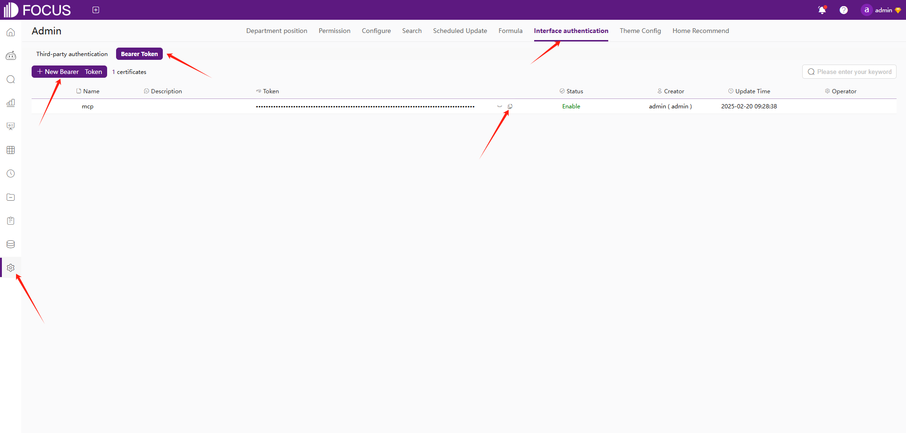
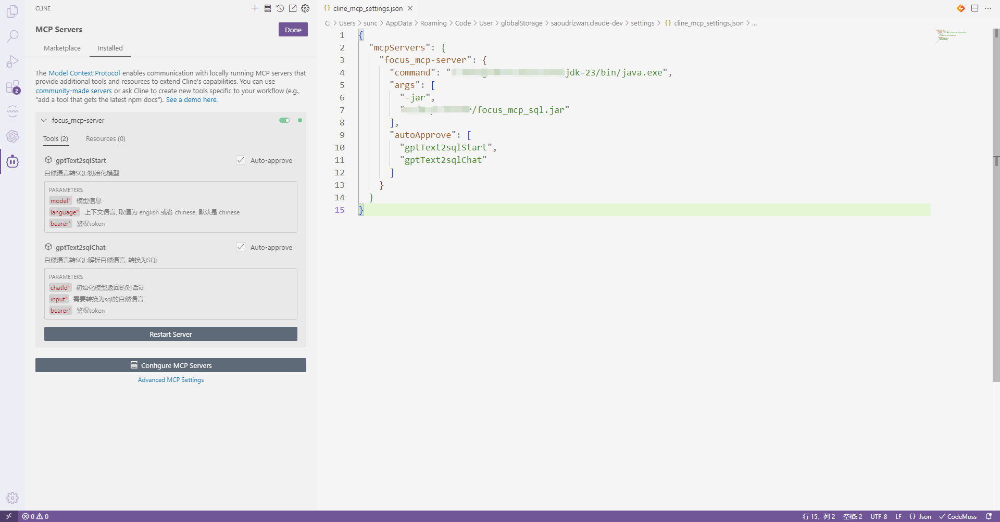
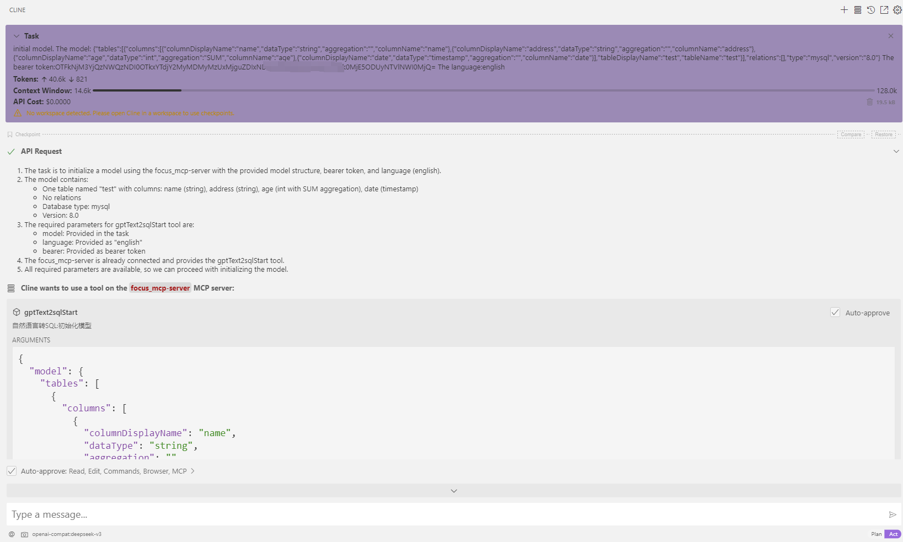
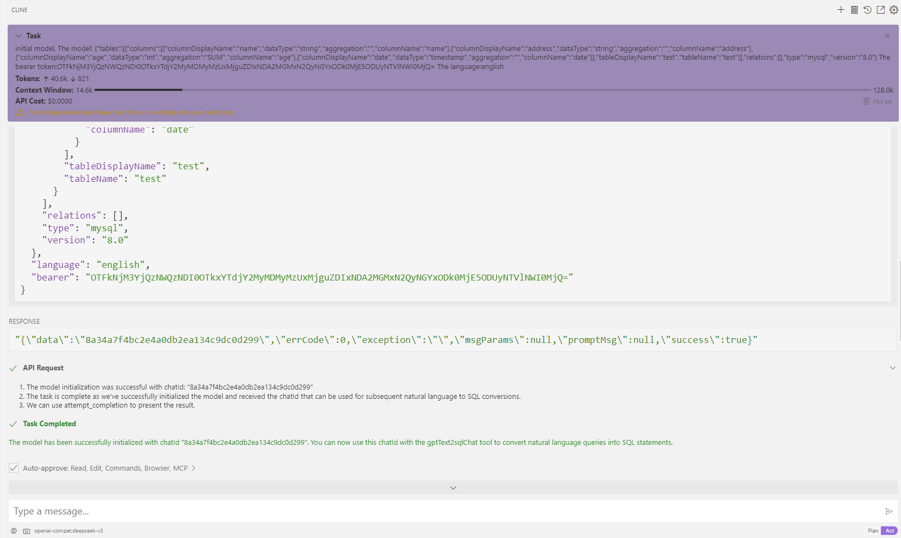
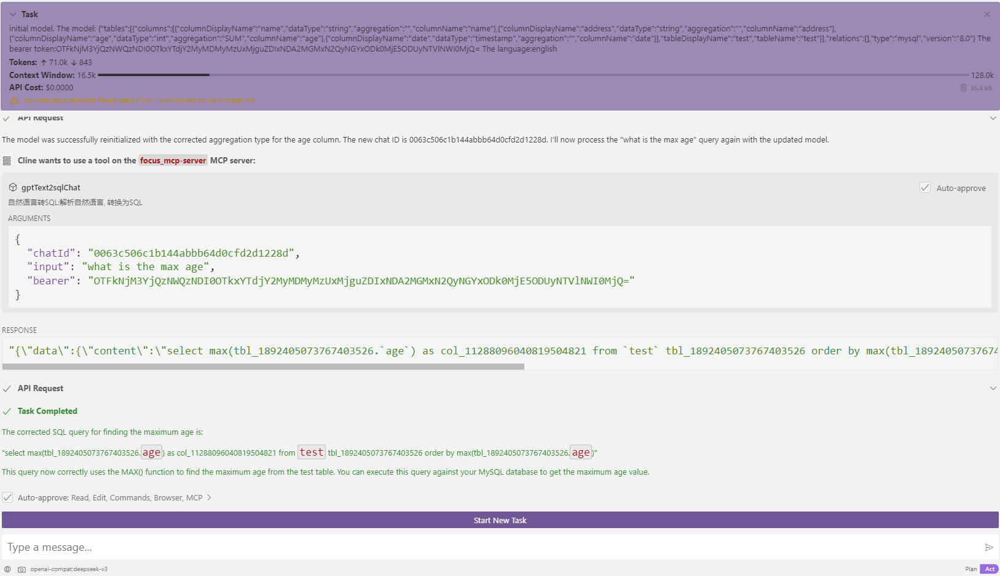

# FOCUS DATA MCP Server [[中文](./README_CN.md)]

A Model Context Protocol (MCP) server enables artificial intelligence assistants to convert natural language into SQL statements.

## Features

-Initialize the model
-Convert natural language to SQL statements

## Prerequisites

- jdk 23 or higher. Download [jdk](https://www.oracle.com/java/technologies/downloads/)
- gradle 8.12 or higher. Download [gradle](https://gradle.org/install/)
- register [Datafocus](https://www.datafocus.ai/) to obtain bearer token: 
    1. Register an account in [Datafocus](https://www.datafocus.ai/)
    2. Create an application
    3. Enter the application
    4. Admin -> Interface authentication -> Bearer Token -> New Bearer Token
       

## Installation

1. Clone this repository:

```bash
git clone https://github.com/FocusSearch/focus_mcp_sql.git
cd focus_mcp_sql
```

2. Build the server:

```bash
gradle clean
gradle bootJar

The jar path: build/libs/focus_mcp_sql.jar
```

## MCP Configuration

Add the server to your MCP settings file:

```json
{
  "mcpServers": {
    "focus_mcp_data": {
      "command": "java",
      "args": [
        "-jar",
        "path/to/focus_mcp_sql/focus_mcp_sql.jar"
      ],
      "autoApprove": [
        "gptText2sqlStart",
        "gptText2sqlChat"
      ]
    }
  }
}
```

## Available Tools

### 1. gptText2sqlStart

initial model.

**Parameters:**

- `model` (required): table model
- `bearer` (required): bearer token
- `language` (optional): language ['english','chinese']

**Example:**

```json
{
  "model": {
    "tables": [
      {
        "columns": [
          {
            "columnDisplayName": "name",
            "dataType": "string",
            "aggregation": "",
            "columnName": "name"
          },
          {
            "columnDisplayName": "address",
            "dataType": "string",
            "aggregation": "",
            "columnName": "address"
          },
          {
            "columnDisplayName": "age",
            "dataType": "int",
            "aggregation": "SUM",
            "columnName": "age"
          },
          {
            "columnDisplayName": "date",
            "dataType": "timestamp",
            "aggregation": "",
            "columnName": "date"
          }
        ],
        "tableDisplayName": "test",
        "tableName": "test"
      }
    ],
    "relations": [

    ],
    "type": "mysql",
    "version": "8.0"
  },
  "bearer": "ZTllYzAzZjM2YzA3NDA0ZGE3ZjguNDJhNDjNGU4NzkyYjY1OTY0YzUxYWU5NmU="
}
```

model 参数说明：

|名称|位置|类型|必选|说明|
|---|---|---|---|---|
| model|body|object| 是 |none|
|» type|body|string| 是 |数据库类型|
|» version|body|string| 是 |数据库版本|
|» tables|body|[object]| 是 |表结构列表|
|»» tableDisplayName|body|string| 否 |表显示名|
|»» tableName|body|string| 否 |表原始名|
|»» columns|body|[object]| 否 |表列列表|
|»»» columnDisplayName|body|string| 是 |列显示名|
|»»» columnName|body|string| 是 |列原始名|
|»»» dataType|body|string| 是 |列数据类型|
|»»» aggregation|body|string| 是 |列聚合方式|
|» relations|body|[object]| 是 |表关联关系列表|
|»» conditions|body|[object]| 否 |关联条件|
|»»» dstColName|body|string| 否 |dimension 表关联列原始名|
|»»» srcColName|body|string| 否 |fact 表关联列原始名|
|»» dimensionTable|body|string| 否 |dimension 表原始名|
|»» factTable|body|string| 否 |fact 表原始名|
|»» joinType|body|string| 否 |关联类型|

### 2. gptText2sqlChat

Convert natural language to SQL.

**Parameters:**

- `chatId` (required): chat id
- `input` (required): Natural language
- `bearer` (required): bearer token

**Example:**

```json
{
  "chatId": "03975af5de4b4562938a985403f206d4",
  "input": "what is the max age",
  "bearer": "ZTllYzAzZjM2YzA3NDA0ZGE3ZjguNDJhNDjNGU4NzkyYjY1OTY0YzUxYWU5NmU="
}
```

## Response Format

All tools return responses in the following format:

```json
{
  "errCode": 0,
  "exception": "",
  "msgParams": null,
  "promptMsg": null,
  "success": true,
  "data": {
  }
}
```

## Visual Studio Code Cline Sample

1. vsCode install cline plugin
2. mcp server config
   
3. use
    1. initial model
       
       
    2. transfer: what is the max age
       
